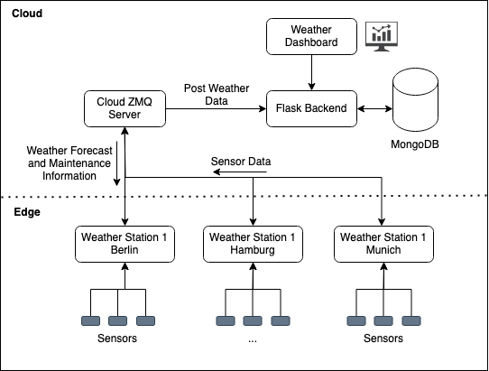
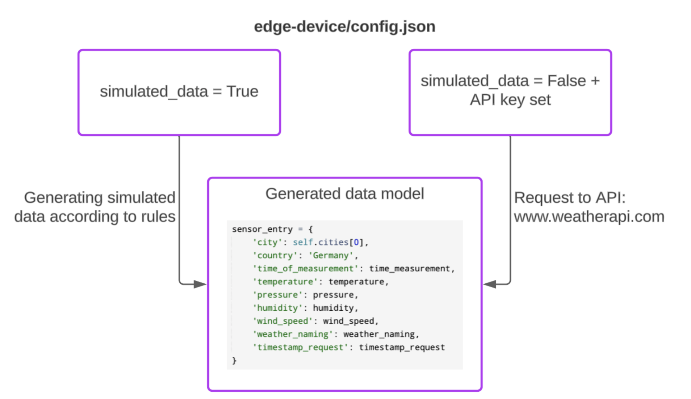
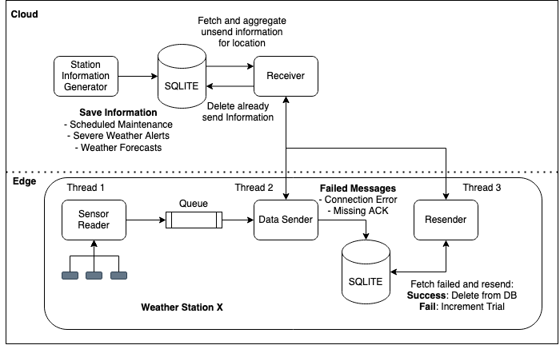
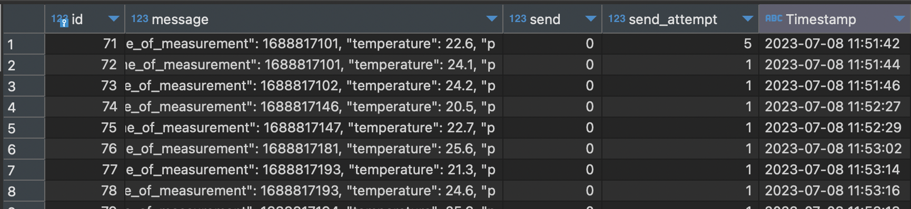
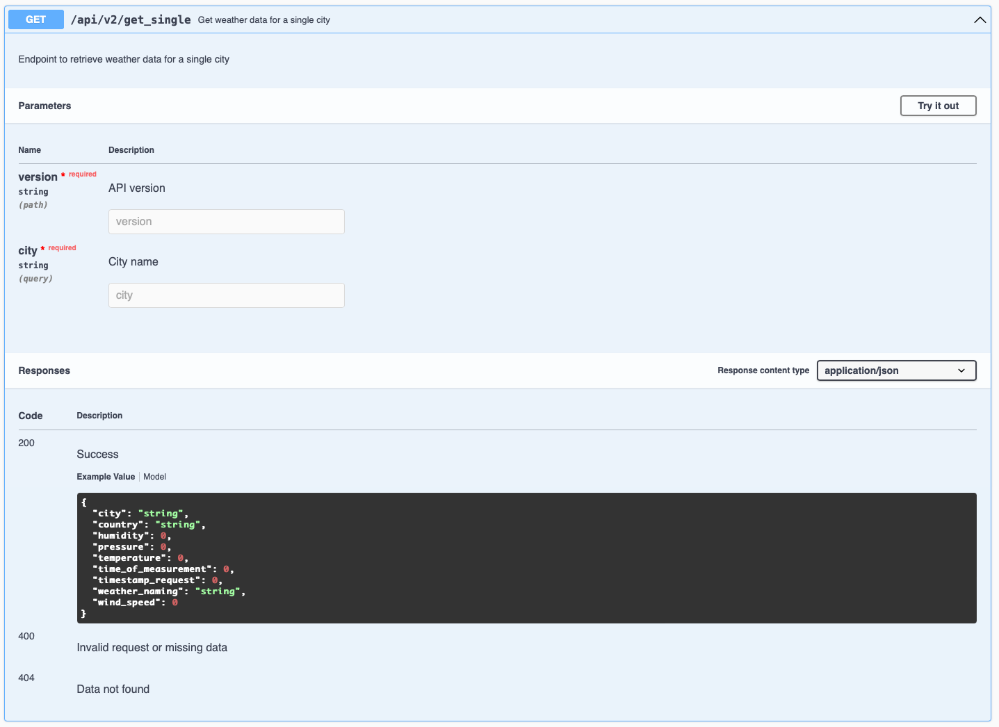
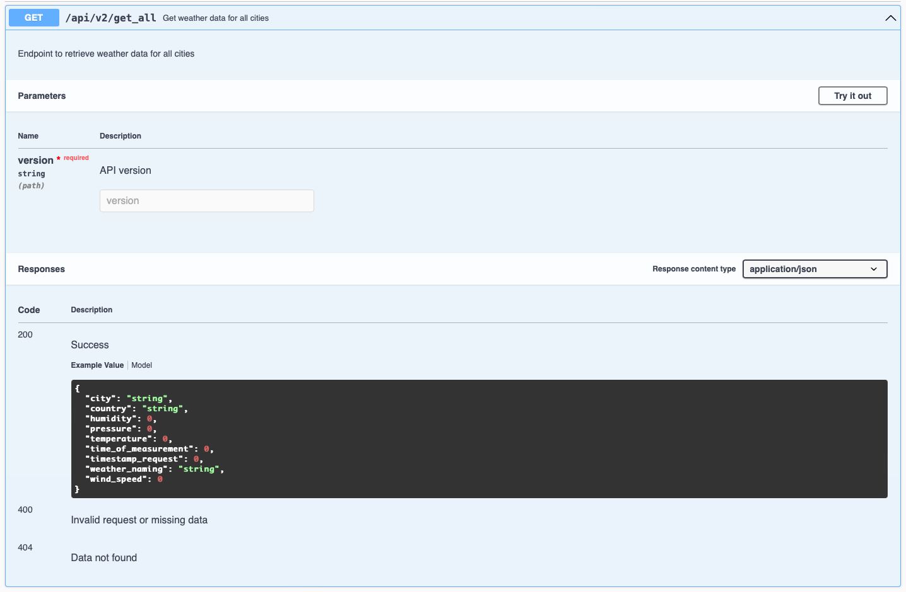
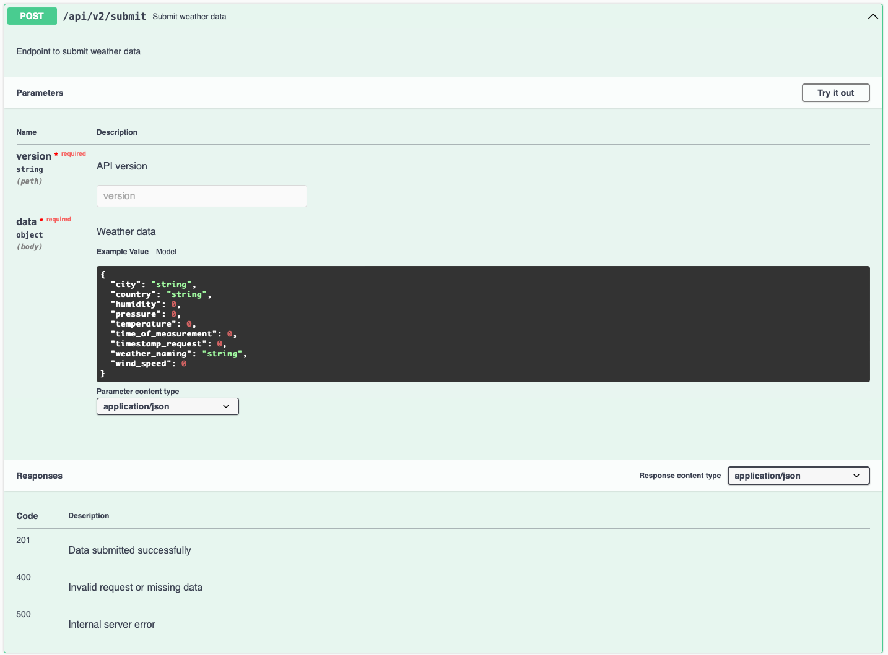
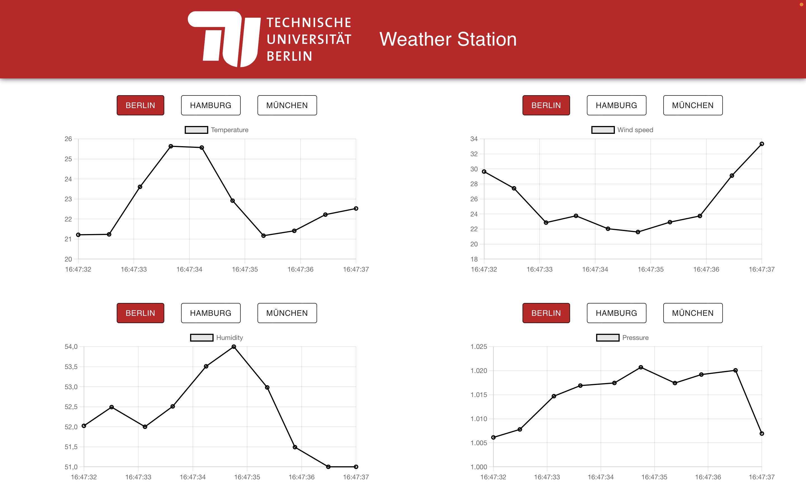

# Fog Computing Project 🚀 | Summer Term 2023 TU Berlin
We are pleased to present our project, developed as part of the "Fog Computing" course at TU Berlin. In this endeavor, we focused on the development of an application for weather data collection using simulated sensors. Our main objective was to apply the concepts of Fog Computing to efficiently and reliably gather and process weather data.
For our simulation, we modeled three weather stations located in the cities of Hamburg, Berlin, and Munich. Each station continuously collects data on various meteorological parameters such as temperature, pressure, humidity, and wind speed. These data are of crucial importance for various applications, including weather forecasting, agriculture, and construction planning.
To efficiently capture and process the data, we opted for the Fog Computing approach. This involves leveraging a decentralized network of fog i.e. edge devices to perform data processing and storage closer to the data sources. This enables faster response to events, reduces data traffic to the central data center, and provides increased control over data privacy. Our application utilizes this Fog Computing architecture by capturing data from the simulated weather stations and transmitting it in real-time to the Fog devices. 
This README.md file will provide detailed insights into the architecture of our application, the implementation of the simulated sensors, and the algorithms employed for data processing. 

# Demo Video

[hier kommt das Video]

<video width="320" height="240" controls>
  <source src="documentation/demo/demo_video.mov" type="video/mp4">
</video>


# Documentation & License

[Click here to view the documenation](./documentation/Fog-Computing-Report.pdf)

[Click here to view the license](./LICENSE)


# Architecture

<p align="center">

</p>
<p align="center">
  <em>Architecture</em>
</p>

# Data generation

We use four sensors to collect the weather data (temperature, pressure, humidity, and wind speed sensors). We then have two options for sourcing the data: (i) simulating the environmental data within a specific range or (ii) parsing live data from the weather API provided by www.weatherapi.com.

<p align="center">

</p>
<p align="center">
  <em>Sensors</em>
</p>

# Reliable messaging

As our solution operates in a distributed fog environment we need to consider that outages on multiple edge devices or server nodes could occur. To address this challenge we implemented several mechanisms to counteract such failures. This mechanisms ensure: (i) reading sensor data is never blocked by connection issues, (ii) failed data is persisted to disk and gets retried and (iii) if the Station fails after a restart the persisted data gets resend. For more information about the implemented mechanisms see the doc file.

<p align="center">

</p>
<p align="center">
  <em>Reliable messaging</em>
</p>

The following picture shows a sample from the SQLite DB on one of the weather stations storing messages which were not able to be sent. Every entry has a unique id, a timestamp, a flag showing if it was sent or not, the number of sending attempts and then actual message body.

<p align="center">

</p>
<p align="center">
  <em>SQLite sample</em>
</p>

# Backend

Our Backend consists of a weather data API build with the Flask framework and MongoDB for data storage. The Flask API supports three major endpoints: (i) submit weather data, (ii) retrieve data for a single city and (iii) obtain data for all cities. The backend code also includes error handling, such as returning appropriate HTTP status codes and error messages for scenarios like invalid requests, missing data, data not found and more. To enhance the usability and documentation of our API, we have integrated Swagger UI.

## GET single
<p align="center">

</p>
<p align="center">
  <em>GET weather data of single city</em>
</p>

## GET all
<p align="center">

</p>
<p align="center">
  <em>GET weather data of all cities</em>
</p>

## POST data
<p align="center">

</p>
<p align="center">
  <em>POST weather data for a city</em>
</p>

# Dashboard

The application is provided with a dashboard. It visualizes the collected weather data for four variables (temperature, pressure, humidity, and wind speed) in three different cities (Hamburg, Berlin, and Munich) in the form of interactive diagrams.

<p align="center">

</p>
<p align="center">
  <em>Dashboard</em>
</p>


# Running the application

The application conists of four components:
- cloud-server
- cloud-backend
- cloud-dashboard
- weather-stations


### Running Locally using Docker Compose

All 4 components can be run locally using docker-compose
```
docker-compose up
```

The first time this might take a while as it first needs to build the docker images. But once it is running you should be able to access:

- Dashboard: http://localhost:3000
- Backend: http://localhost:5000/api/docs

And you should be able to see incoming data from the 3 edge clients (if the edge clients are set to send realistic data you need an api key from http://api.weatherapi.com).


### Deplyoment on GCE

For a proper deployment we used to VMs, one running the dashboard and the second one running the backend and the server. On both VMs you can use docker compose to start the components.

```
docker-compose up -d cloud-control-dashboard
docker-compose up -d cloud-backend cloud-server
```

The dashboard is then available at http://VM_EXTERNAL_IP:3000 and the backend at http://VM_EXTERNAL_IP:5000/api/docs

For running in the cloud there is also a mongdoDB required. We used a managed MongoDB Atlas instance. The connection string can be configured in the backend using the environment variable `MONGO_END`, `MONGO_USR`, `MONGO_PWD`.

The edge clients can be run as before using docker-compose using the environment variable `SERVER_ADDRESS` to point to the cloud-server. On default docker-compose spins up three edge clients for Berlin, Hamburg and Munich.
